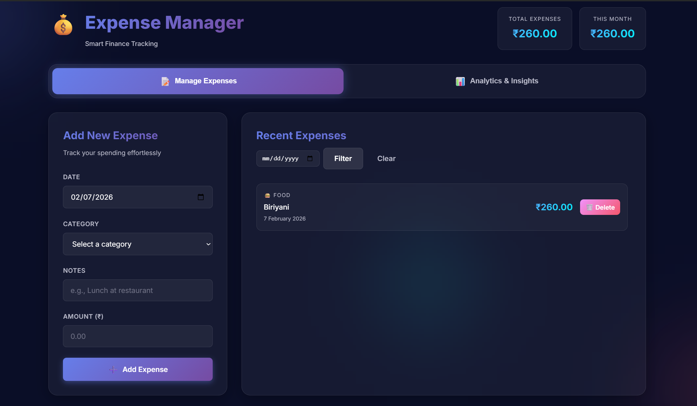

# Expense Manager 💰


A full-stack expense tracking application with glassmorphism UI, real-time analytics, and comprehensive testing. Built with FastAPI backend serving both the REST API and the vanilla JavaScript frontend as a single unified server.

## 🎯 Features

- **Glassmorphism UI** — Modern frosted glass design with animated gradients
- **Expense Management** — Add, view, filter, and delete expenses with category tracking
- **Analytics Dashboard** — Visual category breakdown with date range analysis
- **RESTful API** — FastAPI backend with Pydantic validation
- **MySQL Database** — Persistent storage with parameterized queries
- **Comprehensive Testing** — 41+ test cases covering all functionality
- **Logging** — File and console logging for debugging
- **Single Server** — Frontend served as static files from the FastAPI backend

## ☁️ AWS Deployment Architecture

**Live URL:** `http://<elastic-beanstalk-url>`

### Architecture

```
GitHub Push
    ↓
GitHub Actions (CI/CD)
    ↓ Deploy
Elastic Beanstalk (Python + Docker)
    ↓ connects
RDS MySQL (managed database)
    ↓ fetches credentials
AWS Secrets Manager (DB credentials)
```

### AWS Services Used

| Service | Purpose |
|---------|---------|
| **Elastic Beanstalk** | Hosts the FastAPI application (auto-scaling, load balancing) |
| **RDS MySQL** | Managed relational database (automated backups, high availability) |
| **Secrets Manager** | Stores database credentials securely (no .env files on server) |
| **IAM Role** | Grants Beanstalk permission to access Secrets Manager |
| **GitHub Actions** | Auto-deploys on every push to main branch |

### Deployment Steps

**1. Create RDS MySQL instance**
```
AWS Console → RDS → Create database → MySQL
- Template: Free tier
- DB identifier: expense-manager-db
- Username: admin
- Enable public access: No (private within VPC)
```

**2. Store DB credentials in Secrets Manager**
```bash
# AWS Console → Secrets Manager → Store a new secret
# Secret name: expense-manager/db-credentials
# Keys: DB_HOST, DB_USER, DB_PASSWORD, DB_NAME
```

**3. Create IAM Role for Elastic Beanstalk**
```
IAM → Roles → Create role → EC2
Attach: SecretsManagerReadWrite
Name: expense-manager-eb-role
```

**4. Create Elastic Beanstalk environment**
```
Elastic Beanstalk → Create environment → Web server environment
- Platform: Python or Docker
- Upload your application code as a zip
- Attach IAM instance profile: expense-manager-eb-role
```

**5. Set environment variables in Beanstalk**
```
Configuration → Software → Environment properties
DB_HOST, DB_USER, DB_PASSWORD, DB_NAME
(pulled from Secrets Manager at startup)
```

**6. GitHub Actions CI/CD**

Add these secrets in GitHub → Settings → Secrets → Actions:
- `AWS_ACCESS_KEY_ID`
- `AWS_SECRET_ACCESS_KEY`
- `EB_APP_NAME` - Elastic Beanstalk application name
- `EB_ENV_NAME` - Elastic Beanstalk environment name

Every push to `main` automatically packages and deploys the application.

### Pause / Cleanup

```
# Pause: Beanstalk Console → Environment → Actions → Terminate environment
# Full cleanup: Terminate environment → Delete application → Delete RDS instance → Delete secret
```

## 📁 Project Structure

```
expense-manager/
├── backend/
│   ├── server.py           # FastAPI application (serves API + frontend)
│   └── db_helper.py        # Database operations
├── frontend/
│   ├── index.html          # Main HTML structure
│   ├── style.css           # Glassmorphism styling
│   └── app.js              # JavaScript logic (uses relative API URLs)
├── tests/
│   └── backend/
│       ├── test_db_helper.py   # Database tests
│       └── test_server.py      # API endpoint tests
├── logs/                   # Application logs
├── schema.sql              # Database setup script
├── Dockerfile              # Container configuration
├── requirements.txt
└── pyproject.toml          # Pytest configuration
```

## 🚀 Getting Started (Local)

### Prerequisites

- Python 3.8+
- MySQL 8.0+

### Database Setup

The project includes a `schema.sql` file for easy database setup. Run it using:

```bash
mysql -u root -p < schema.sql
```

Or manually create the database:

```sql
CREATE DATABASE expense_manager;
USE expense_manager;

CREATE TABLE expenses (
    id INT AUTO_INCREMENT PRIMARY KEY,
    expense_date DATE NOT NULL,
    category VARCHAR(100) NOT NULL,
    notes TEXT,
    amount DECIMAL(10, 2) NOT NULL CHECK (amount > 0),
    created_at TIMESTAMP DEFAULT CURRENT_TIMESTAMP,
    INDEX idx_expense_date (expense_date),
    INDEX idx_category (category)
);
```

### Installation

1. **Clone the repository**

```bash
git clone <your-repo-url>
cd expense-manager
```

2. **Set up MySQL database**

```bash
mysql -u root -p < schema.sql
```

3. **Install Python dependencies**

```bash
pip install -r requirements.txt
```

4. **Configure environment variables**

```bash
cp .env.example .env
```

Edit `.env` with your MySQL credentials:

```env
DB_HOST=localhost
DB_USER=root
DB_PASSWORD=your_password_here
DB_NAME=expense_manager
```

5. **Run the server** (serves both API and frontend)

```bash
uvicorn backend.server:app --host 0.0.0.0 --port 8000
```

Open `http://localhost:8000` — the frontend loads automatically.

## 💻 Usage

### API Endpoints

| Method   | Endpoint                           | Description                |
| -------- | ---------------------------------- | -------------------------- |
| `GET`    | `/`                                | Serves the frontend UI     |
| `GET`    | `/health`                          | Health check               |
| `GET`    | `/expenses/{date}`                 | Get expenses for a date    |
| `POST`   | `/expenses/{date}`                 | Add expenses for a date    |
| `DELETE` | `/expenses/{date}`                 | Delete expenses for a date |
| `GET`    | `/summary?start_date=X&end_date=Y` | Get expense summary        |

### Example Requests

**Add Expense:**

```bash
curl -X POST "http://localhost:8000/expenses/2025-12-07" \
  -H "Content-Type: application/json" \
  -d '[{"category": "Food", "notes": "Lunch", "amount": 250.50}]'
```

**Get Summary:**

```bash
curl "http://localhost:8000/summary?start_date=2025-12-01&end_date=2025-12-07"
```

## 📸 Screenshots


_Expense-Manager Application Interface_

## 🧪 Testing

Run all tests:

```bash
pytest
```

Run with coverage:

```bash
pytest --cov=backend --cov-report=html
```

## 🐳 Docker

### Build Image

```bash
docker build -t expense-manager .
```

### Run Container

```bash
docker run -p 8000:8000 --env-file .env expense-manager
```

## 🔧 Troubleshooting

### Database Connection Issues

**Error: "Access denied for user"**

- Check your MySQL credentials in `.env`
- Ensure MySQL user has permissions: `GRANT ALL ON expense_manager.* TO 'root'@'localhost';`

**Error: "Can't connect to MySQL server"**

- Verify MySQL is running: `sudo service mysql status` (Linux) or check services (Windows)
- Check `DB_HOST` in `.env` matches your MySQL host

**Error: "Unknown database 'expense_manager'"**

- Run the schema script: `mysql -u root -p < schema.sql`

### Port Conflicts

If port 8000 is already in use:

```bash
uvicorn backend.server:app --host 0.0.0.0 --port 8001
```

## 📄 License

MIT License
